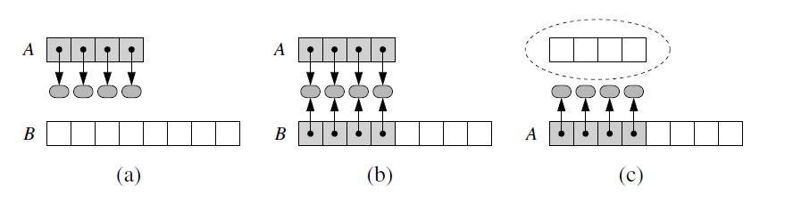

## Explanation
Dynamic array are used for the python list class.
A list allows us to add elements to the list with no 
apparent limit to the overall capacity of the list.
It does this by using dynamic arrays.
This repo provides an implementation of a dynamic Array Class 
similar to how python lists work

## How do they work
First, it is important to note that a list instance maintains
an underlying array with greater capacity than the current 
length.
E.g if a user has created a list with 5 elements,the system
may reserve an underlying array capable of storing 8.

But if the user keeps on appending elements,the reserved 
capacity will eventually be exhausted.
In that case,the class requests a new, larger array from the
system, and initializes the new array so that its prefix matches that of the existing
smaller array. At that point in time, the old array is no longer needed, so it is
reclaimed by the system.

## Implementing a dynamic Array

If an element is appended to a list at a time when the 
underlying array is full, we perform the following steps:
1. Allocate a new array B with larger capacity.(here chosen as twice the size 
of current one)
2. Set B[i] = A[i], for i = 0, . . . ,n−1, where n denotes current number of items.
3. Set A = B, that is, we henceforth use B as the array supporting the list.
4. Insert the new element in the new array

### Illustration

## More Notes
This class has only limited functionality in the form of
1. len - for getting length
2. getitem - for returning an item given an index
3. append -adding an item

