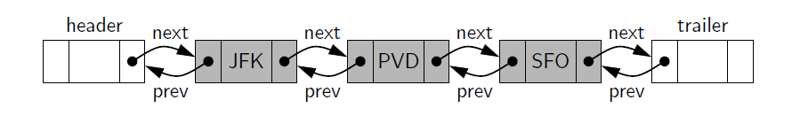

## Explanation
A linked list in which each node keeps
an explicit reference to the node before it and a reference to the node after it. Such
a structure is known as a doubly linked list. These lists allow a greater variety of
O(1)-time update operations, including insertions and deletions at arbitrary positions
within the list.

It helps to add special nodes at both ends of the list: a header node at the
beginning of the list, and a trailer node at the end of the list. These “dummy” nodes
are known as sentinels (or guards), and they do not store elements of the primary
sequence. A doubly linked list with such sentinels is shown.

### Insertion and deletion of nodes
When a new element is inserted at the front of the sequence,
we will simply add the new node between the header and the
node that is currently after the header.

The deletion of a node: The two neighbors of the node to be deleted are linked directly
to each other, thereby bypassing the original node.