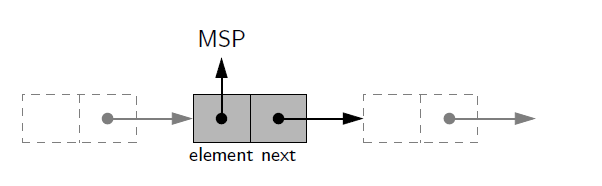
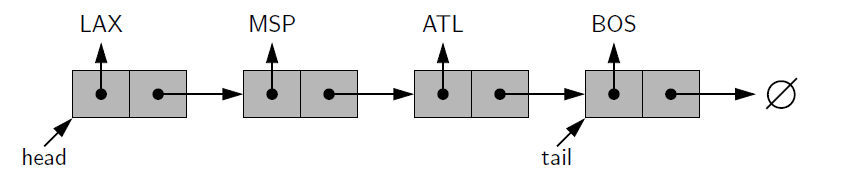

## Explanation
A singly linked list, in its simplest form, is a collection of nodes that collectively
form a linear sequence. Each node stores a reference to an object that is an element
of the sequence, as well as a reference to the next node of the list
 

### Implementing a stack using a singly Linked List
The LinkedStack file demonstrates how to implement a stack.
Essentially, we add and remove elements at the front of the list 
to represent top of stack

### Implementing a Queue using SLT
The LinkedQueue file demonstrates this