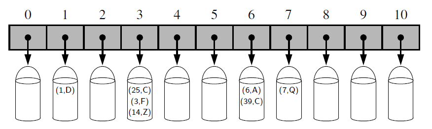
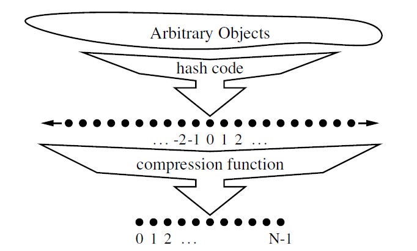

## Explanation

The novel concept for a hash table is the use of a hash function to map general
keys to corresponding indices in a table.  Ideally, keys will be well distributed in the
range from 0 to N −1 by a hash function, but in practice there may be two or more
distinct keys that get mapped to the same index. As a result, we will conceptualize
our table as a bucket array.  

## Hash Functions
The goal of a hash function, h, is to map each key k to an integer in the range
 [0,N −1], where N is the capacity of the bucket array for a hash table. Equipped
with such a hash function, h, the main idea of this approach is to use the hash
function value, h(k), as an index into our bucket array, A, instead of the key k
(which may not be appropriate for direct use as an index).

If there are two or more keys with the same hash value, then two different items
will be mapped to the same bucket in A. In this case, we say that a **collision** has
occurred.

It is common to view the evaluation of a hash function, h(k), as consisting of
two portions—a hash code that maps a key k to an integer, and a compression
function that maps the hash code to an integer within a range of indices, [0,N −1],
for a bucket array.

## 1. Hash Code
## Cyclic shift hash code
This involves a cyclic
shift of a partial sum by a certain number of bits. For example, a 5-bit cyclic shift
of the 32-bit value **00111**101100101101010100010101000 is achieved by taking
the leftmost five bits and placing those on the rightmost side of the representation,
resulting in 101100101101010100010101000**00111**.

An implementation of a cyclic shift hash code for a character string is 
done in **hash_code.py**

## Hash Codes in Python
The standard mechanism for computing hash codes in Python is a built-in function
with signature hash(x) that returns an integer value that serves as the hash code for
object x. However, only immutable data types are deemed hashable
in Python.  

Instances of user-defined classes are treated as unhashable by default, with a
TypeError raised by the hash function. However, a function that computes hash
codes can be implemented in the form of a special method named hash within
a class.

An important rule to obey is that if a class defines equivalence through eq ,
then any implementation of hash must be consistent, in that if x == y, then
hash(x) == hash(y).

## 2. Compression Function
Once we have determined an integer hash code for
a key object k, there is still the issue of mapping that integer into the range [0,N−1].
This computation, known as a compression function, is the second action performed
as part of an overall hash function