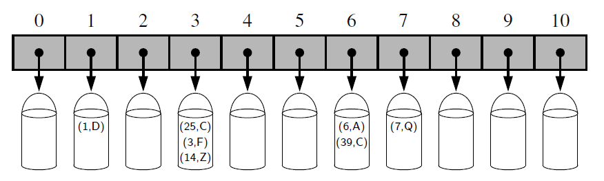
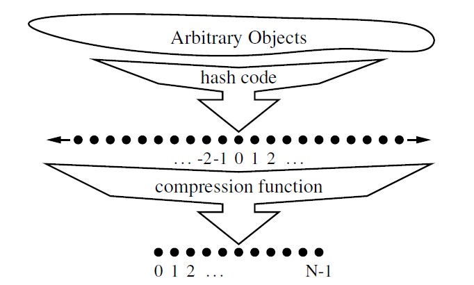
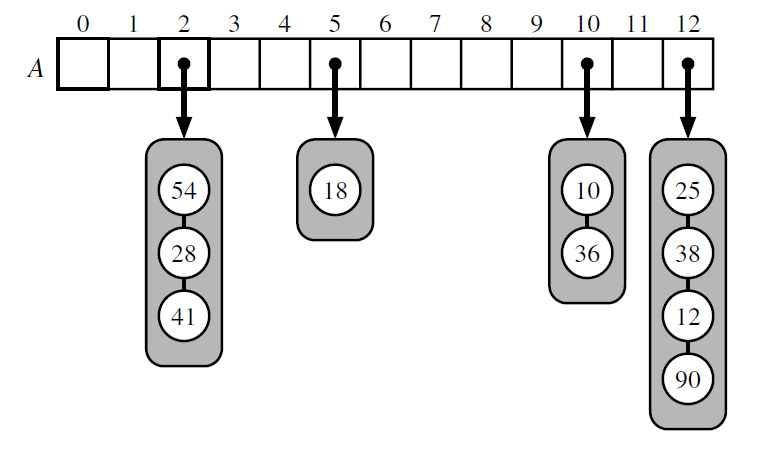
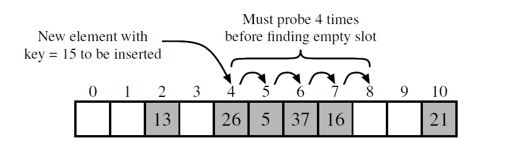

## Explanation

The novel concept for a hash table is the use of a hash function to map general
keys to corresponding indices in a table.  Ideally, keys will be well distributed in the
range from 0 to N −1 by a hash function, but in practice there may be two or more
distinct keys that get mapped to the same index. As a result, we will conceptualize
our table as a bucket array.  

## Hash Functions
The goal of a hash function, h, is to map each key k to an integer in the range
 [0,N −1], where N is the capacity of the bucket array for a hash table. Equipped
with such a hash function, h, the main idea of this approach is to use the hash
function value, h(k), as an index into our bucket array, A, instead of the key k
(which may not be appropriate for direct use as an index).

If there are two or more keys with the same hash value, then two different items
will be mapped to the same bucket in A. In this case, we say that a **collision** has
occurred.

It is common to view the evaluation of a hash function, h(k), as consisting of
two portions—a hash code that maps a key k to an integer, and a compression
function that maps the hash code to an integer within a range of indices, [0,N −1],
for a bucket array.

## 1. Hash Code
## Cyclic shift hash code
This involves a cyclic
shift of a partial sum by a certain number of bits. For example, a 5-bit cyclic shift
of the 32-bit value **00111**101100101101010100010101000 is achieved by taking
the leftmost five bits and placing those on the rightmost side of the representation,
resulting in 101100101101010100010101000**00111**.

An implementation of a cyclic shift hash code for a character string is 
done in **hash_code.py**

## Hash Codes in Python
The standard mechanism for computing hash codes in Python is a built-in function
with signature hash(x) that returns an integer value that serves as the hash code for
object x. However, only immutable data types are deemed hashable
in Python.  

Instances of user-defined classes are treated as unhashable by default, with a
TypeError raised by the hash function. However, a function that computes hash
codes can be implemented in the form of a special method named hash within
a class.

An important rule to obey is that if a class defines equivalence through eq ,
then any implementation of hash must be consistent, in that if x == y, then
hash(x) == hash(y).

## 2. Compression Function
Once we have determined an integer hash code for
a key object k, there is still the issue of mapping that integer into the range [0,N−1].
This computation, known as a compression function, is the second action performed
as part of an overall hash function

### Multiply-Add-and-Divide (or “MAD”) method.
This method maps an integer i to  
**[(ai+b) mod p] mod N**,  
where N is the size of the bucket array, 
p is a prime number larger than N,  
and a
and b are integers chosen at random from the interval [0, p−1],
with a > 0. 
This
compression function is chosen in order to eliminate repeated patterns in the set of
hash codes and get us closer to having a “good” hash function, that is, one such that
the probability any two different keys collide is 1/N.

N.B:://
**“good” hash function, that is, one such that
the probability any two different keys collide is 1/N**

## Collision Handling Schemes
### 1. Separate Chaining
A simple and efficient way for dealing with collisions is to have each bucket A[ j]
store its own secondary container, holding items (k,v) such that h(k) = j. A natural
choice for the secondary container is a small map
instance implemented using a list.

Assuming we use a good hash function to index the n items
of our map in a bucket array of capacity N, the expected size of a bucket is n/N.
Therefore, if given a good hash function, the core map operations run in O(
[n/N]).
The ratio λ = n/N, called the **load factor** of the hash table, should be bounded by
a small constant, preferably below 1.

### 2. Open Adressing
If space is at a premium (for example, if we are writing a program for a
small handheld device), then we can use the alternative approach of always storing
each item directly in a table slot.
### Linear Probing
A simple method for collision handling with open addressing
is linear probing.  
With this approach, if we try to insert an item (k,v) 
into a bucket A[ j] that is already
occupied, where j = h(k), then we next try A[( j+1) mod N].   
If A[( j+1) mod N]
is also occupied, then we try A[( j+2) mod N], and so on,
until we find an empty
bucket that can accept the new item.   Once this bucket is located, we simply insert
the item there.

## Python Hash Table Implementation
For that reason, we extend the MapBase
class , to define a new HashMapBase class , providing much of the common functionality to our two hash table
implementations. 

The main design elements of the HashMapBase class are:  
• The bucket array is represented as a Python list, named self. table, with all
entries initialized to None.  
• We maintain an instance variable self. n that represents the number of distinct
items that are currently stored in the hash table.  
• If the load factor of the table increases beyond 0.5, we double the size of the
table and rehash all items into the new table. 
• We define a hash function utility method that relies on Python’s built-in
hash function to produce hash codes for keys, and a randomized Multiply-
Add-and-Divide (MAD) formula for the compression function.  

**Separate Chaining**  
ChainHashMap.py provides a concrete implementation of a hash table with separate
chaining, in the form of the ChainHashMap class. To represent a single bucket,
it relies on an instance of the UnsortedTableMap class.

**Linear Probing**  
Our implementation of a ProbeHashMap class, using open addressing with linear
probing, is given in ProbeHashMap.py.  
In order to support deletions, we place a special marker
in a table location at which an item has been deleted, so that we can distinguish
between it and a location that has always been empty.  
In our implementation, we
declare a class-level attribute, AVAIL, as a sentinel.

