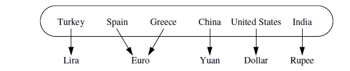

## Explanation
It represents an abstraction in which unique keys are mapped
to associated values. Values do not have to be unique.

## The Map ADT
We begin by listing what we consider the
most significant five behaviors of a map M as follows:  
**M[k]:** Return the value v associated with key k in map M, if
one exists; otherwise raise a KeyError. In Python, this is
implemented with the special method getitem .  
**M[k] = v:** Associate value v with key k in map M, replacing the existing
value if the map already contains an item with key
equal to k. In Python, this is implemented with the special
method setitem . 
**del M[k]:** Remove from map M the item with key equal to k; if M
has no such item, then raise a KeyError. In Python, this is
implemented with the special method delitem .  
**len(M):** Return the number of items in map M. In Python, this is
implemented with the special method len . 
**iter(M):** The default iteration for a map generates a sequence of
keys in the map. In Python, this is implemented with the
special method iter , and it allows loops of the form,
for k in M.

For additional convenience,
map M should also support the following behaviors:  
**k in M:** Return True if the map contains an item with key k. In
Python, this is implemented with the special contains
method.  
**M.get(k, d=None):** Return M[k] if key k exists in the map; otherwise return
default value d. This provides a form to query M[k] without
risk of a KeyError. 
**M.setdefault(k, d):** If key k exists in the map, simply return M[k]; if key k
does not exist, set M[k] = d and return that value. 
**M.pop(k, d=None):** Remove the item associated with key k from the map and
return its associated value v. If key k is not in the map,
return default value d (or raise KeyError if parameter d is
None). 

**M.popitem():** Remove an arbitrary key-value pair from the map, and return
a (k,v) tuple representing the removed pair. If map is
empty, raise a KeyError. 
**M.clear( ):** Remove all key-value pairs from the map. 
**M.keys( ):** Return a set-like view of all keys of M. 
**M.values( ):** Return a set-like view of all values of M. 
**M.items( ):** Return a set-like view of (k,v) tuples for all
entries of M. 
**M.update(M2):** Assign M[k] = v for every (k,v) pair in map M2. 
**M == M2:** Return True if maps M and M2 have identical key-value
associations. 
**M != M2:** Return True if maps M and M2 do not have identical keyvalue
associations. 

## Implementation in python

The collections module provides two abstract base classes that are relevant to
our current discussion: the Mapping and MutableMapping classes.  The Mapping
class includes all nonmutating methods supported by Python’s dict class, while the
MutableMapping class extends that to include the mutating methods.

In particular, the MutableMapping
class provides concrete implementations for all behaviors other than the first five
: getitem , setitem , delitem , len , and
iter .  
As we implement the map abstraction with various data structures, as
long as we provide the five core behaviors, we can inherit all other derived behaviors
by simply declaring MutableMapping as a parent class.

Our MapBase class is defined in **MapBase.py**, extending
the existing MutableMapping abstract base class so that we inherit the many
useful concrete methods that class provides.  
We then define a nonpublic nested
Item class, whose instances are able to store both a key and value.

## Simple Unsorted Map Implementation

**UnsortedTableMap.py** presents an UnsortedTableMap
class that relies on storing key-value pairs in 
arbitrary order within a Python list.  
An empty table is initialized as self. table within 
the constructor for our map.  
When a new key is entered into the map, ,
we create a new instance of the nested Item class, which is inherited from our
MapBase class.  
This list-based map implementation is simple, but it is not particularly efficient.  
Each of the fundamental methods, getitem , setitem , and delitem ,
relies on a for loop to scan the underlying list of items in search of a matching key.  
In a best-case scenario, such a match may be found near the beginning of the list, in
which case the loop terminates; in the worst case, the entire list will be examined.
Therefore, each of these methods runs in O(n) time on a map with n items.