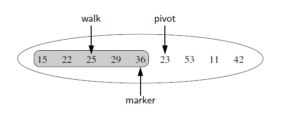

## Explanation

To provide for a general abstraction of a sequence of elements with the ability to
identify the location of an element, we define a positional list ADT as well as a
simpler position abstract data type to describe a location within a list. 
  A position acts as a marker or token within the broader positional list.

A position p is unaffected by changes elsewhere in a list; the only way in which a position becomes
invalid is if an explicit command is issued to delete it.  
A position instance is a simple object, supporting only the following method:
**p.element():** Return the element stored at position p.  
In the context of the positional list ADT, positions serve as parameters to some
methods and as return values from other methods. 

In describing the behaviors of a positional list, we being by presenting 
the accessor methods supported by a list L: 
**L.first():** Return the position of the first element of L, 
or None if L is empty. 
**L.last( ):** Return the position of the last element of L,
or None if L is empty. 
**L.before(p):** Return the position of L immediately before position p, or None
if p is the first position.

**L.after(p):** Return the position of L immediately after position p, or None if
p is the last position. 
**L.is empty( ):** Return True if list L does not contain any
elements. 
**len(L):** Return the number of elements in the list.
**iter(L):** Return a forward iterator for the elements of
the list.  

The positional list ADT also includes the following update methods: 
**L.add first(e):** Insert a new element e at the front of L,
returning the position
of the new element. 
**L.add last(e):** Insert a new element e at the back of L, returning the position
of the new element. 
**L.add before(p, e):** Insert a new element e just before position p in L, returning
the position of the new element. 
**L.add after(p, e):** Insert a new element e just after position p in L, returning
the position of the new element. 
**L.replace(p, e):** Replace the element at position p with element e, returning
the element formerly at position p. 
**L.delete(p):** Remove and return the element at position p in L, invalidating
the position. 
For those methods of the ADT that accept a position p as a parameter, an error
occurs if p is not a valid position for list L.

### Implementation in Python
We rely on the DoublyLinkedBase class from the Doubly Linked Lists Folder for our low-level
representation; the primary responsibility of our new class is to provide a public
interface in accordance with the positional list ADT. We begin our class definition
with the definition of the public Position class, nested within
our PositionalList class. Position instances will be used to represent the locations
of elements within the list. Our various PositionalList methods may end up creating
redundant Position instances that reference the same underlying node (for example,
when first and last are the same). For that reason, our Position class defines the
eq and ne special methods so that a test such as p == q evaluates to
True when two positions refer to the same node.

The access methods of the PositionalList class  and the update methods trivially adapt the underlying doubly linked list implementation to support the public
interface of the positional list ADT. Those methods rely on the validate utility
to “unwrap” any position that is sent. They also rely on a make position utility
to “wrap” nodes as Position instances to return to the user, making sure never to
return a position referencing a sentinel. For convenience, we have overridden the
inherited insert between utility method so that ours returns a position associated
with the newly created node (whereas the inherited version returns the node itself ).

### Sorting a positional list
Sorting is done using the Insertion sort algorithm(see sorting algorithms)
in which each element is placed relative to a growing collection 
of previously sorted elements.

We maintain a variable named marker that represents the rightmost position of
the currently sorted portion of a list. During each pass, we consider the position just
past the marker as the pivot and consider where the pivot’s element belongs relative
to the sorted portion; we use another variable, named walk, to move leftward from
the marker, as long as there remains a preceding element with value larger than the
pivot’s. 

