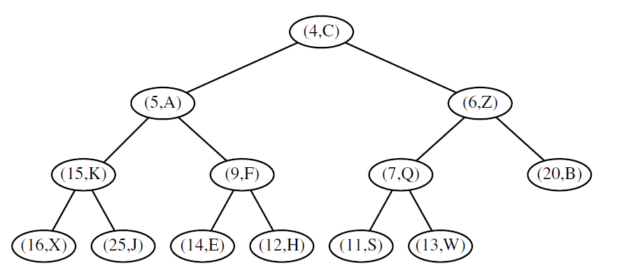
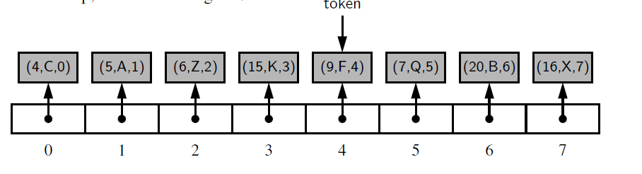

## Heaps
A heap  is a binary tree T that stores a collection of items at its
positions and that satisfies two additional properties: a relational property defined
in terms of the way keys are stored in T and a structural property defined in terms
of the shape of T itself. 

The relational property is the following:In a heap T, for every position p other than the root, the
key stored at p is greater than or equal to the key stored at p’s parent.

Structural / Complete Binary Tree Property: A heap T with height h is a complete binary tree
if levels 0,1,2, . . . ,h−1 of T have the maximum number of nodes possible
(namely, level i has 2^i nodes, for 0 ≤ i ≤ h−1) and the remaining nodes at
level h reside in the leftmost possible positions at that level.

## Implementing priority queue using heap

### Adding an Item to the Heap
Let us consider how to perform add(k,v) on a priority queue implemented with a
heap T. We store the pair (k,v) as an item at a new node of the tree. To maintain
the complete binary tree property, that new node should be placed at a position p
just beyond the rightmost node at the bottom level of the tree, or as the leftmost
position of a new level, if the bottom level is already full
(or if the heap is empty).  
### Up-Heap Bubbling After an Insertion
After this action, the tree T is complete, but it may violate the heap-order property.
Hence, unless position p is the root of T (that is, the priority queue was empty
before the insertion), we compare the key at position p to that of p’s parent, which
we denote as q. If key kp ≥kq, the heap-order property is satisfied and the algorithm
terminates. If instead kp < kq, then we need to restore the heap-order property,
which can be locally achieved by swapping the entries stored at 
positions p and q.

### Down-Heap Bubbling After a Removal
 If T has only one node (the root), then the heap-order
property is trivially satisfied and the algorithm terminates. Otherwise, we distinguish
two cases, where p initially denotes the root of T:  
• If p has no right child, let c be the left child of p.  
• Otherwise (p has both children), let c be a child of p with minimal key.  
If key kp ≤ kc, the heap-order property is satisfied and the algorithm terminates. If
instead kp >kc, then we need to restore the heap-order property. This can be locally
achieved by swapping the entries stored at p and c.

## Array Based Representation of a complete Binary Tree
The elements
of T are stored in an array-based list A such that the element at position p in T is
stored in A with index equal to the level number f (p) of p, 
defined as follows:  
• If p is the root of T, then f (p) = 0.  
• If p is the left child of position q, then f (p) = 2 f (q)+1.  
• If p is the right child of position q, then f (p) = 2 f (q)+2.

## Bottom Up Heap Construction
For simplicity of exposition, we describe this bottom-up heap construction assuming
the number of keys, n, is an integer such that n = 2^(h+1) − 1. That is,
the heap is a complete binary tree with every level being full, so the heap has
height h = log(n+1)−1. Viewed non recursively, bottom-up heap construction
consists of the following h+1 = log(n+1) steps:

In the generic ith step, 2≤i≤h, we form(n+1)/2^i heaps, each storing 2i−1
entries, by joining pairs of heaps storing (2^(i−1)−1) entries (constructed in the
previous step) and adding a new entry. The new entry is placed initially at
the root, but may have to move down with a down-heap bubbling to preserve
the heap-order property.

### Python implementation of a bottom up heap construction
With our array-based representation of a heap, if we initially store all n items in
arbitrary order within the array, we can implement the bottom-up heap construction
process with a single loop that makes a call to downheap from each position of
the tree, as long as those calls are ordered starting with the deepest level and ending
with the root of the tree. In fact, that loop can start with the deepest nonleaf, since
there is no effect when down-heap is called at a leaf position

## Adaptable Priority Queue
We may desire to have additional methods to our priority queue such as 
update and remove.  
In order to implement methods update and remove efficiently, we need a mechanism
for finding a user’s element within a priority queue that avoids performing a
linear search through the entire collection.  
To support our goal, when a new element
is added to the priority queue, we return a special object known as a locator to
the caller.  We then require the user to provide an appropriate locator as a parameter
when invoking the update or remove method, as follows,  
for a priority queue P:  
**P.update(loc, k, v):** Replace key and value for the item identified by locator loc.
**P.remove(loc):** Remove the item identified by locator loc from the priority
queue and return its (key,value) pair.

The locator abstraction is somewhat akin to the Position abstraction used in our
positional list ADT.

We may represent a heap using a sequence of locators.

Each Locator has: key, value, current index

### Python Implementation
We define a public Locator
class that inherits from the nonpublic Item class and augments it with an additional
index field.

To update locators during the flow of our heap operations, we rely on an intentional
design decision that our original class uses a nonpublic swap method for all
data movement. We override that utility to execute the additional step of updating
the stored indices within the two swapped locator instances.

We provide a new bubble utility that manages the reinstatement of the heaporder
property when a key has changed at an arbitrary position within the heap,
either due to a key update, or the blind replacement of a removed element with the
item from the last position of the tree. The bubble utility determines whether to
apply up-heap or down-heap bubbling, depending on whether the given location
has a parent with a smaller key.

