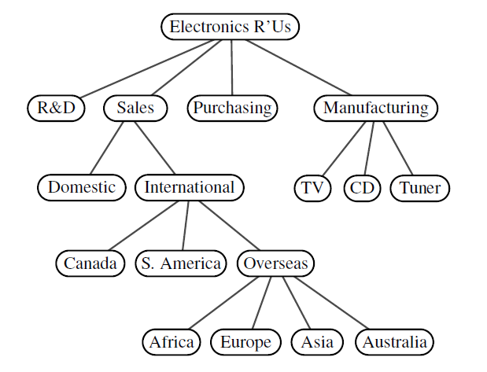
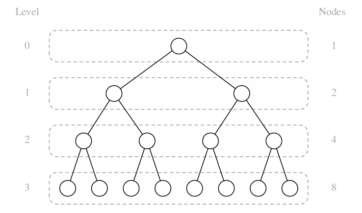
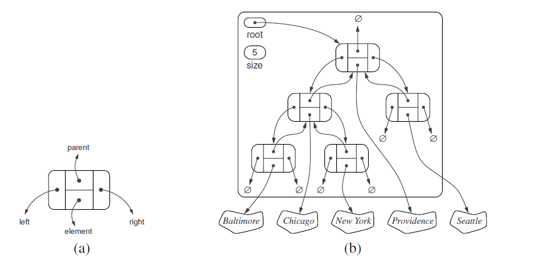

## Explanation
A tree is an abstract data type that stores elements hierarchically. With the exception
of the top element, each element in a tree has a parent element and zero or
more children elements. 

A tree is usually visualized by placing elements inside
ovals or rectangles, and by drawing the connections between parents and children
with straight lines. We typically call the top element the **root**
of the tree, but it is drawn as the highest element, with the other elements being
connected below (just the opposite of a botanical tree).

### Formal tree definition
Formally, we define a tree T as a set of nodes storing elements such that the nodes
have a parent-child relationship that satisfies the following 
properties:  
• If T is nonempty, it has a special node, called the root of T,
that has no parent. 
• Each node v of T different from the root has a unique parent node w; every
node with parent w is a child of w.

Two nodes that are children of the same parent are **siblings**.
A node v is **external** if v has no children.
A node v is **internal** if it has one or more children. External
nodes are also known as **leaves**.

A node u is an **ancestor** of a node v if u = v or u is an ancestor of the parent
of v. Conversely, we say that a node v is a **descendant** of a node u if u is an ancestor
of v.

An **edge** of tree T is a pair of nodes (u,v) such that u 
is the parent of v, or vice versa. A **path** of T is a 
sequence of nodes such that any two consecutive nodes in
the sequence form an edge.

## The Tree ADT

We define a tree ADT using the
concept of a position as an abstraction for a node of a tree.
An element is stored at each position, and positions satisfy parent-child relationships that define the tree
structure. 

A position object for a tree supports the method: 
**p.element()**: Return the element stored at position p.

The tree ADT then supports the following accessor methods, allowing a user to
navigate the various positions of a tree:  
**T.root():** Return the position of the root of tree T,
or None if T is empty.  
**T.is root(p):** Return True if position p is the root of Tree T. 
**T.parent(p):** Return the position of the parent of position p,
or None if p is the root of T. 
**T.num children(p):** Return the number of children of position p. 
**T.children(p):** Generate an iteration of the children of position p.

**T.is leaf(p):** Return True if position p does not have any children. 
**len(T):** Return the number of positions (and hence elements) that
are contained in tree T. 
**T.is empty():** Return True if tree T does not contain any positions. 
**T.positions():** Generate an iteration of all positions of tree T. 
**iter(T):** Generate an iteration of all elements stored within tree T. 

### Implementation in Python
The file Tree.py is an abstract base class that implements the above
methods.

## Binary Tree
A binary tree is an ordered tree with the following properties:  
1. Every node has at most two children.
2. Each child node is labeled as being either a left child or a right child.
3. A left child precedes a right child in the order of children 
of a node

As an abstract data type, a binary tree is a specialization of a tree that supports three
additional accessor methods:  
**T.left(p):** Return the position that represents the left child of p,
or None if p has no left child.  
**T.right(p):** Return the position that represents the right child of p,
or None if p has no right child.  
**T.sibling(p):** Return the position that represents the sibling of p,
or None if p has no sibling.

### Implementation in Python
We rely on inheritance to define the BinaryTree class 
based upon the existing Tree class.

# Implementing Trees
## 1. Linked Binary Tree
A natural way to realize a binary tree T is to use a linked structure, with a node
that maintains references to the element stored at a position p
and to the nodes associated with the children and parent of p.

The tree itself maintains an
instance variable storing a reference to the root node (if any), and a variable, called
size, that represents the overall number of nodes of T.

We define a concrete LinkedBinaryTree class that implements the
binary tree ADT by subclassing the BinaryTree class