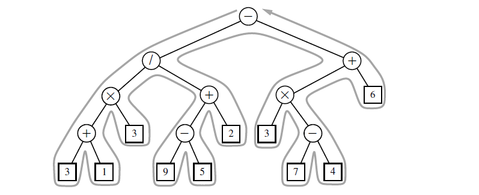

## Explanation
The Euler tour
traversal of a general tree T can be informally defined as a “walk” around T, where
we start by going from the root toward its leftmost child, viewing the edges of T as
being “walls” that we always keep to our left.

Algorithm eulertour(T, p):  
** **perform the “pre visit” action for position p 
**  **for each child c in T.children(p) do:  
********eulertour(T, c) {recursively tour the subtree rooted at c}
   **   **perform the “post visit” action for position p

## Template method pattern
The template
method pattern describes a generic computation mechanism that can be specialized
for a particular application by redefining certain steps.  
To allow customization, the
primary algorithm calls auxiliary functions known as hooks at designated steps of
the process.  
In the context of an Euler tour traversal, we define two separate hooks, a previsit
hook that is called before the subtrees are traversed, and a postvisit hook that is
called after the completion of the subtree traversals.  
Our implementation will take
the form of an EulerTour class that manages the process, and defines trivial definitions
for the hooks that do nothing. The traversal can be customized by defining
a subclass of EulerTour and overriding one or both hooks to provide specialized
behavior.

## Implementation
The
primary recursive process is defined in the nonpublic tour method. A tour instance
is created by sending a reference to a specific tree to the constructor, and then by
calling the public execute method, which beings the tour and returns a final result
of the computation.