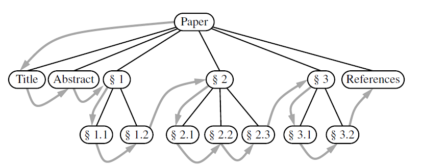
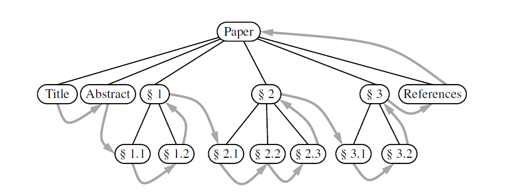
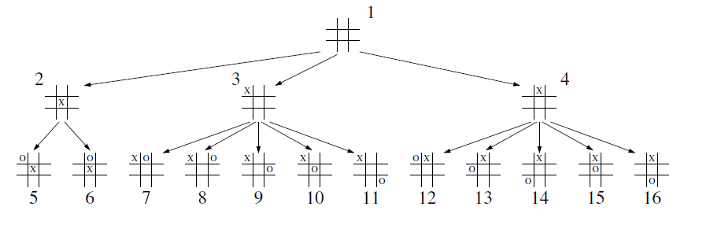
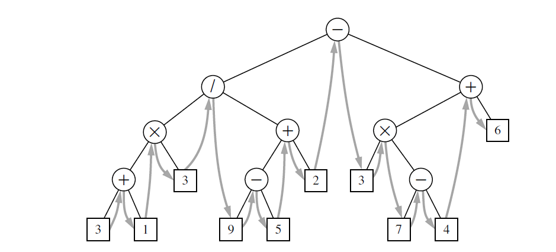

## Explanation

A traversal of a tree T is a systematic way of accessing, or “visiting,” all the positions
of T.

## Traversal of General Tress
## 1. Preorder traversal
In a preorder traversal of a tree T, the root of T is visited first and then the subtrees
rooted at its children are traversed recursively

Algorithm preorder(T, p): 
**    **perform the “visit” action for position p 
**    **for each child c in T.children(p) do:  
****  ****preorder(T, c) {recursively traverse the subtree rooted at c}

## 2. Postorder traversal
It recursively traverses the subtrees rooted at the children of the root first, and
then visits the root (hence, the name “postorder”).

Algorithm postorder(T, p):  
** **for each child c in T.children(p) do: 
****** **postorder(T, c) {recursively traverse the subtree rooted at c} 
** **perform the “visit” action for position p

## 3. Breadth-first traversal
It traverses a tree so that we visit
all the positions at depth d before we visit the positions 
at depth d +1.

We use a queue to produce a FIFO (i.e., first-in first-out) 
semantics for the order in which
we visit nodes.  
The overall running time is O(n), due to the n calls to 
enqueue and 
n calls to dequeue.  

Algorithm breadth_first(T):  
Initialize queue Q to contain T.root()  
while Q not empty do:  
  **   **  p = Q.dequeue( ) {p is the oldest entry in the queue}  
 **   **   perform the “visit” action for position p  
 **   **  for each child c in T.children(p) do:  
 **   **   **   **  Q.enqueue(c) {add p’s children to the end of
the queue for later visits}

## Traversal of Binary Trees
## 1. Inorder Traversal
The inorder traversal of a binary tree T can be
informally viewed as visiting the nodes of T “from left to right.” Indeed, for every
position p, the inorder traversal visits p after all the positions in the left subtree of
p and before all the positions in the right subtree of p.

Basically : left subtree, current position, right subtree

Algorithm inorder(p):  
  ** **  if p has a left child lc then:  
**       ****      **inorder(lc) {recursively traverse the 
left subtree of p}  
**  **perform the “visit” action for position p  
** **if p has a right child rc then:  
****  ****inorder(rc) {recursively traverse the right subtree of p}

## Implementation
The file Tree.py copies the original tree.py and implements
the traversal methods.
The file BinaryTree.py implements the inorder traversal